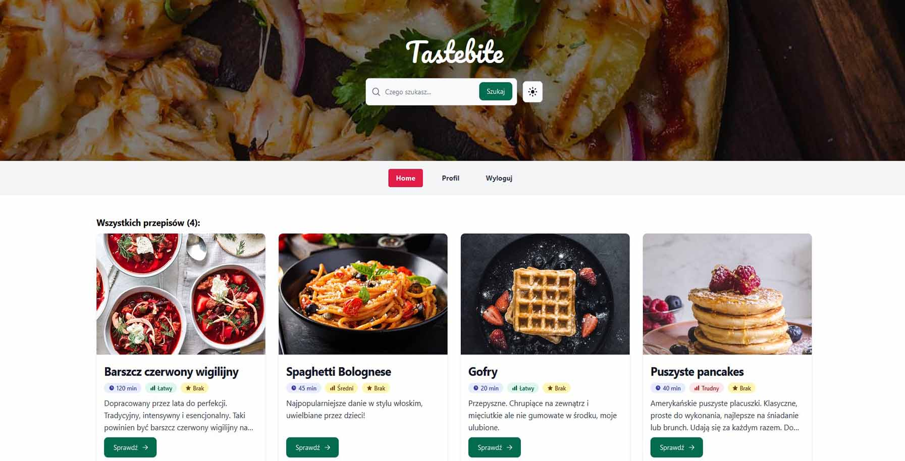

# Tastebite Recipes App



Application with the ability to add and manage recipes.

https://tastebite-app-sd.vercel.app

## Main technologies


## Stack

- [Firebase](https://firebase.google.com) - backend by Google, app development platform that helps you build and grow apps
- [Flowbite](https://flowbite.com) - an open-source library of UI components based on the utility-first Tailwind CSS framework
- [Formik](https://formik.org) - the world's most popular open source form library for React and React Native
- [Heroicons](https://heroicons.com/) - beautiful hand-crafted SVG icons, by the makers of Tailwind CSS
- [React Router](https://reactrouter.com/en/main) - a standard library for routing in React
- [React Query](https://tanstack.com/query/v4) - powerful asynchronous state management for TS/JS, React, Solid, Vue and Svelte
- [Vite](https://vitejs.dev) - a new breed of frontend build tooling that significantly improves the frontend development experience
- [Yup](https://github.com/jquense/yup) - a schema builder for runtime value parsing and validation

## Details

- created with the React (Vite) and TypeScript
- CRUD - the ability to manage account and recipes
- data stored on Cloud Firestore
- data fetching and caching with Tanstack React Query
- auth by Firebase Authentication
- context and reducer used to manage context values
- suspense for data fetching with lazy loading
- error boundary to catch errors in child components
- saving data in local storage using custom hook
- routing with React Router
- forms created with the Formik
- form validation and sanitization (yup)
- layout and styling with Tailwind CSS and Flowbite
- responsive website design
- light/dark mode prefer system color scheme

## Tutorial and project structure

Inside of project, you'll see the following folders and files:

```
PROJECT_ROOT
├── public              # static assets
└── src
    ├── assets          # images and files
    ├── components      # React components
    ├── lib
    │   ├── context     # React context and reducer files
    │   ├── firebase    # firebase config and fetch functions
    │   ├── helpers     # helpful functions
    │   ├── hooks       # custom hooks
    │   ├── interfaces  # TypeScript interfaces
    │   └── schemas     # yup schemas
    └── pages           # page files
```

Download the repository to your local machine and run to download all missing dependencies (yarn required):

```
yarn install
```

After that you can run this project using:

```
yarn dev
```

To build your application use:

```
yarn build
```

**To manage the app content you need to create a new Firebase project. Check the official documentation: https://firebase.google.com/docs**

After creating your own firebase project, just create the `.env.local` file with the following data in the main folder and restart your application:

```
VITE_FIREBASE_KEY = YOUR_FIREBASE_KEY
VITE_FIREBASE_AUTH_DOMAIN = YOUR_FIREBASE_AUTH_DOMAIN
VITE_FIREBASE_PROJECT_ID = YOUR_FIREBASE_PROJECT_ID
VITE_FIREBASE_STORAGE_BUCKET = YOUR_FIREBASE_STORAGE_BUCKET
VITE_FIREBASE_MESSAGING_SENDER_ID = YOUR_FIREBASE_MESSAGING_SENDER_ID
VITE_FIREBASE_APP_ID = YOUR_FIREBASE_APP_ID
```
